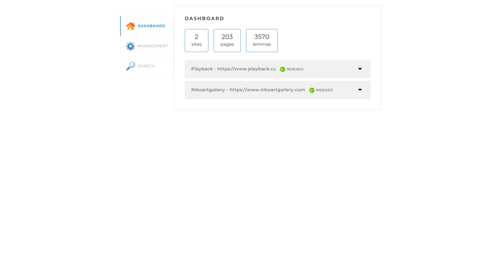

<h1 align="center">SearchEngine</h1>


## Description

SearchEngine implemented by scratch on Spring Boot, PostgreSQL, Liquibase, Docker and Docker-compose. The main features of the search engine are indexing sites, individual pages and searching through them.

## Project setup

Clone project from GIT repository and build project using Maven.

```text
mvn clean install
```
Give execute permissions to file `start.sh` and execute it. Then visit `localhost:8080` and start indexing to ensure that it works.

## Documentation
To view the documentation, run the application and go to 
```text
http://localhost:8080/swagger-ui/index.html
```

## Adding sites for indexing

If you want to add sites that should be indexed, you must add in field `sites` of `application.yml` file the address and name of the site in the format

```text
  - url: https://www.playback.ru
    name: Playback
```